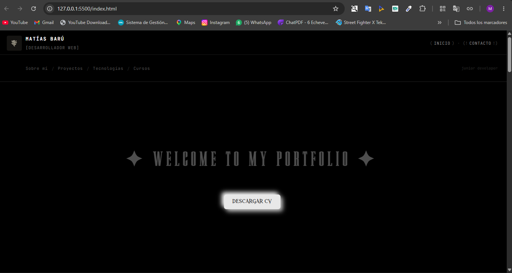
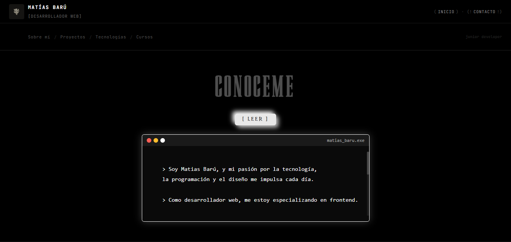
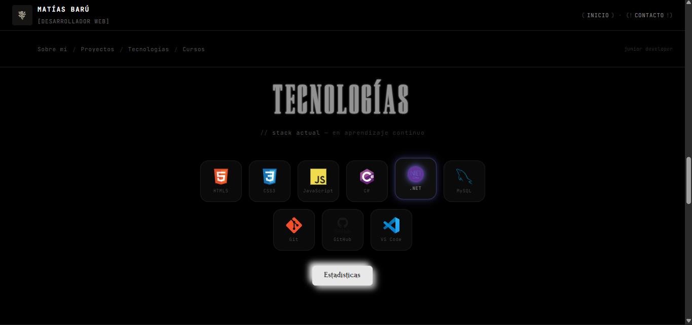
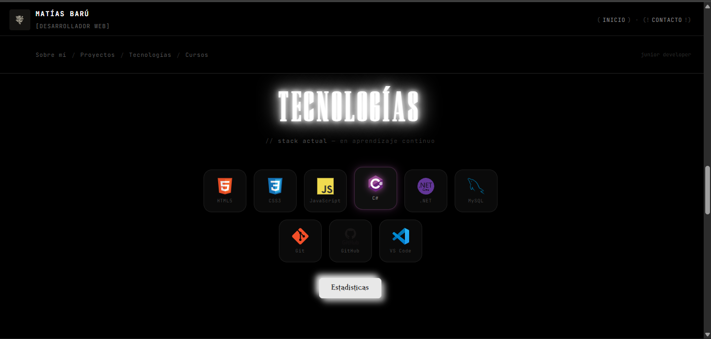
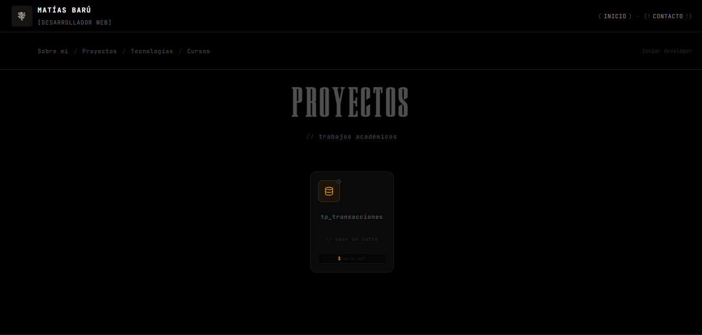
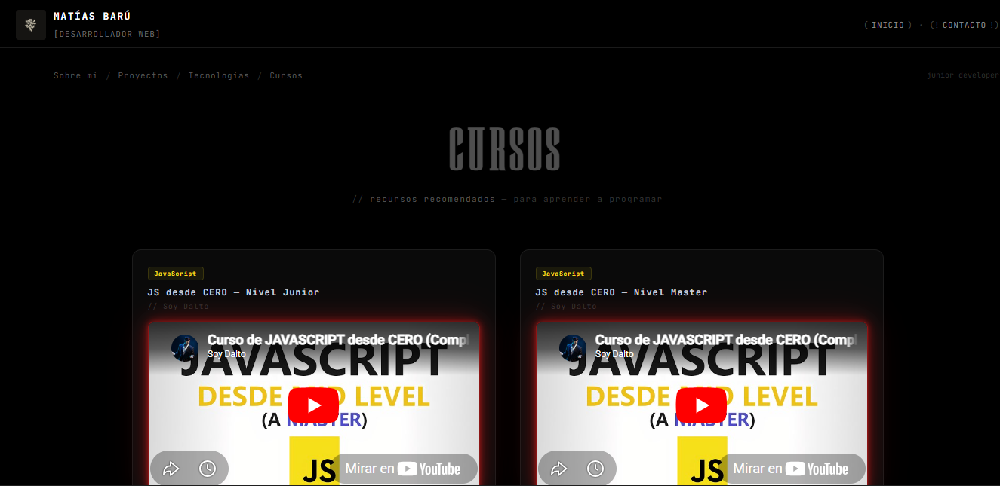
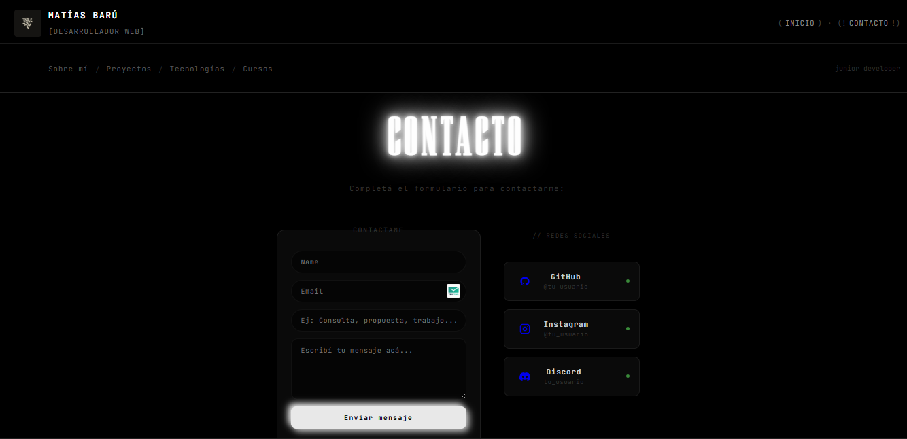

# 💻 Portfolio Web - Matías Barú

## 📌 Descripción
Este proyecto es un portfolio web personal desarrollado con HTML5, CSS3 y JavaScript.
Su objetivo es mostrar información personal, habilidades, tecnologías aprendidas, proyectos y un formulario de contacto.

---

## 📂 Estructura del proyecto

```
portfolio/
├── index.html         # Estructura principal del sitio
├── style.css          # Estilos y diseño visual
├── cv.pdf             # CV descargable
├── fonts/             # Fuentes personalizadas (Luxena, Nordic Frost, Ethereal Nymeria)
├── img/               # Imágenes (logo, GIF de bienvenida)
└── doc/               # Documentos adjuntos (TP, PDFs)
```

---

## 📄 Contenido del sitio

- 🏠 **Inicio** — Hero con título animado y botón para descargar el CV
- 🙋‍♂️ **Sobre mí** — Sección con terminal interactiva que muestra la descripción personal
- 📁 **Proyectos** — Tarjetas de proyectos académicos con acceso al PDF
- 🧠 **Tecnologías** — Grilla de íconos del stack actual + tabla de estadísticas expandible
- 🎓 **Cursos** — Videos de YouTube recomendados con efecto neon
- 📩 **Contacto** — Formulario de contacto + tarjetas de redes sociales

---

## 🛠️ Tecnologías utilizadas

- HTML5
- CSS3
- JavaScript (vanilla, sin librerías ni frameworks)

---

## 🎨 Diseño y estilos (style.css)

El archivo `style.css` define toda la identidad visual del portafolio. El diseño sigue una estética **dark / developer**, inspirada en terminales y editores de código.

### Paleta de colores y variables CSS
Se definen variables globales en `:root` para mantener consistencia:
- Fondo principal: `#000` (negro puro)
- Superficie de tarjetas: `#0a0a0a`
- Bordes: `#1c1c1c`
- Texto principal: `#c9d1d9` (gris claro, estilo GitHub Dark)
- Texto muted: `#555`

### Tipografías
Se importan tres fuentes personalizadas con `@font-face`:
- **Luxena** — usada en títulos de sección (gran tamaño, letras separadas)
- **Nordic Frost** — fuente decorativa alternativa
- **Ethereal Nymeria** — usada en botones principales

Además se usa **JetBrains Mono** (Google Fonts) para todo el contenido de estilo "código" y monoespaciado.

### Navbar
La barra de navegación es sticky (queda fija al hacer scroll). Tiene dos niveles:
- Fila superior: logo con imagen, nombre, rol y accesos rápidos a Inicio y Contacto
- Fila inferior: links de sección y un comentario estilo `// junior developer`

### Animación `titilar`
Los títulos principales usan una animación CSS que simula el parpadeo de una luz de neón: alternan entre gris oscuro y blanco brillante con `text-shadow` para el efecto de brillo.

### Sección "Sobre mí" — Terminal interactiva
Se usa un `<input type="checkbox">` oculto como toggle. Al hacer click en el botón `[ LEER ]`, se activa el checkbox y mediante CSS (selector `~`) se muestra la terminal. La terminal tiene estilos que imitan una consola real: puntos de colores en el header, fondo casi negro, texto blanco monoespacio.

### Sección "Proyectos" — Tarjetas hover
Las tarjetas de proyecto tienen efectos de hover que incluyen elevación (`translateY`), cambio de color de borde y una línea de acento naranja (`#f59e0b`) que aparece en el fondo mediante `::after` con transición de ancho.

### Sección "Tecnologías"
- **Grilla de íconos**: cada tecnología tiene un efecto hover con `box-shadow` de color específico al lenguaje (rojo para HTML, azul para CSS, amarillo para JS, etc.) y `drop-shadow` sobre el ícono SVG.
- **Tabla expandible**: controlada también con checkbox + CSS (`max-height: 0` → `max-height: 600px` con transición), sin JavaScript.
- Los niveles de tecnología se representan con puntos (`dot`) que se colorean según el nivel (violeta para intermedio, verde para avanzado).

### Sección "Cursos" — Efecto neon rojo
Los iframes de YouTube están envueltos en un `div` con clase `.video-neon` que aplica un `box-shadow` animado en rojo, simulando un borde neon pulsante mediante la animación `@keyframes neon-pulso`.

### Sección "Contacto"
- **Formulario**: inputs y textarea con bordes sutiles que se iluminan al hacer foco
- **Tarjetas de redes**: cada red social tiene su propia tarjeta con ícono SVG inline, nombre, handle y un punto de estado verde animado (simula "en línea")

### Botones
Todos los botones principales comparten un estilo neumórfico (sombras suaves claras y oscuras sobre fondo `#e8e8e8`) con hover que ilumina el borde y active que reduce la sombra.

### Footer
Sencillo, monoespacio, con separador superior y link para volver al inicio.

---

## 🎯 Objetivo del proyecto
Aplicar y profundizar conocimientos de HTML y CSS, incluyendo:

- Etiquetas semánticas (`header`, `nav`, `main`, `section`, `footer`)
- Variables CSS y diseño con paleta coherente
- Tipografías personalizadas con `@font-face`
- Animaciones con `@keyframes`
- Interactividad sin JavaScript usando checkboxes y selectores CSS (`~`)
- Efectos visuales: neon, neumorfismo, hover con glow
- Diseño responsive con flexbox

---

## 📸 Vista previa










---

## ⚙️ Funcionalidades JavaScript (script.js)

Toda la interactividad se implementa en un archivo externo `script.js`, vinculado con `<script src="script.js" defer>`, sin ningún `onclick`/`onchange` dentro del HTML.

### Array de datos
- `tecnologias`: array de objetos (nombre, categoría, nivel, año, ícono, descripción) que alimenta **toda** la sección "Tecnologías": tanto la grilla de íconos como la tabla de estadísticas se generan a partir de este único array.

### Funciones principales
- `renderTecnologias(lista)` — crea dinámicamente (`createElement`/`appendChild`) las tarjetas de la grilla y las filas de la tabla a partir del array.
- `filtrarTecnologias(evento)` — buscador en tiempo real: filtra el array por nombre o categoría y vuelve a renderizar.
- `mostrarDescripcionTecnologia` / `ocultarDescripcionTecnologia` — muestran/ocultan una descripción de la tecnología sobre la que se pasa el mouse.
- `mostrarTabla()` — hace scroll suave hasta la tabla de estadísticas al abrirla.
- `actualizarContador(evento)` — contador de caracteres en vivo para el mensaje del formulario.
- `validarFormulario(datos)` — valida los campos obligatorios y lanza errores (`throw`) descriptivos.
- `manejarEnvioFormulario(evento)` — controla el envío del formulario con `try/catch`, muestra mensajes de éxito/error y marca en rojo los campos inválidos.

### Eventos implementados
`input` (buscador de tecnologías) · `mouseover` / `mouseout` (descripción de tecnología) · `click` (ver tabla de estadísticas) · `keyup` (contador de caracteres) · `submit` (validación del formulario de contacto).

### Manipulación del DOM
Creación de elementos (`createElement`), inserción (`appendChild`/`innerHTML`), modificación de texto (`textContent`), y mostrar/ocultar contenido (`classList.add/remove`).

### Validación y manejo de errores
El formulario de contacto valida que los campos obligatorios (nombre, email, mensaje) no estén vacíos y cumplan un largo mínimo, valida el formato del email con una expresión regular, y usa `try { ... } catch(error) { ... }` para capturar errores de validación y mostrarlos al usuario sin romper la ejecución.

### Funcionalidad principal
**Buscador de tecnologías**: mientras el usuario escribe, la grilla y la tabla se filtran en vivo mostrando solo las tecnologías que coinciden con el texto buscado (por nombre o categoría).

---

## 🔗 Repositorio
[github.com/cubanastrike](https://github.com/cubanastrike)

## 👨‍💻 Autor

**Matías Barú**